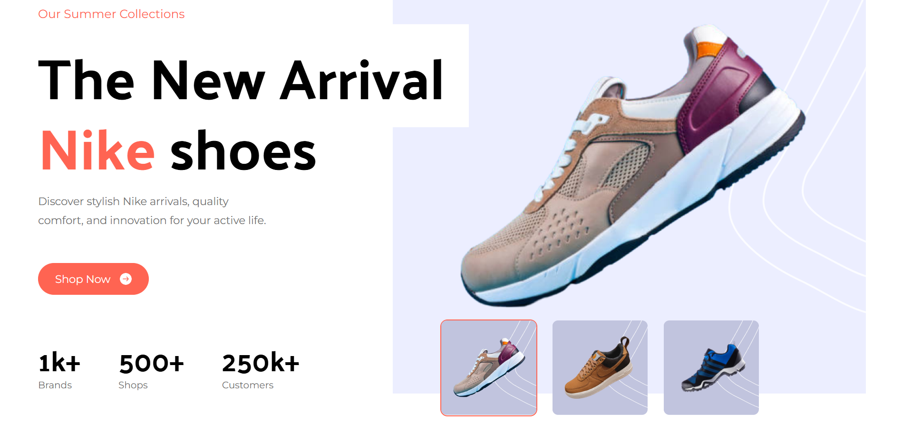
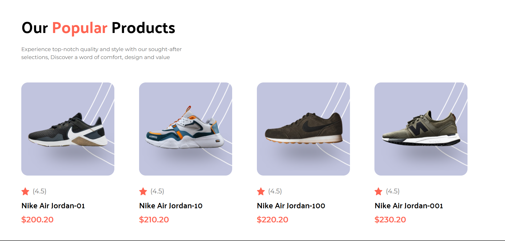
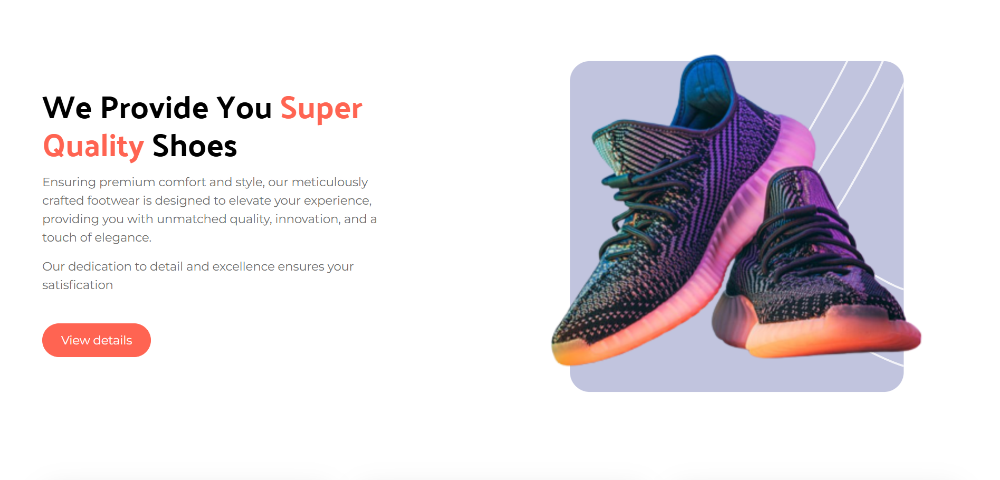

# Nike Landing Page 🏃‍♂️👟

A sleek and modern **Nike Landing Page** built with a focus on clean design, responsive layout, and user experience. This is a frontend project showcasing HTML, CSS (or Tailwind/Bootstrap), and JavaScript fundamentals.

## 🔥 Live Demo

[Click here to view the live demo](https://adityaxkurama.github.io/Nike-Landing-Page/)  

---

## 📸 Screenshots

  
  
  

---

## 🚀 Features

- Hero section with call-to-action
- Product highlights with smooth transitions
- Responsive design for mobile, tablet, and desktop
- Clean UI inspired by Nike's branding
- Custom font and color palette

---

## 🛠️ Technologies Used

- React Js
- HTML5 
- CSS3 / Tailwind CSS 
- JavaScript 

---

